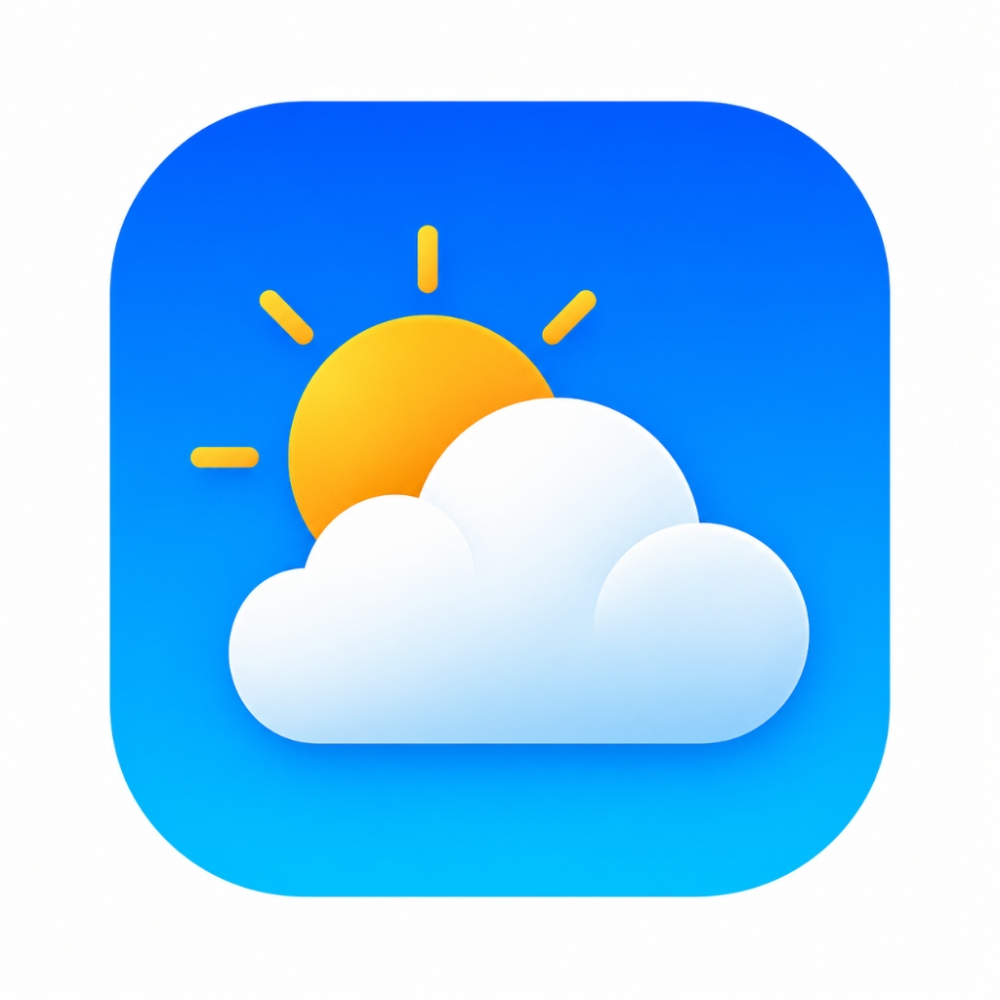

# ⛅ SkyAura

<div align="center">

  
  
  
  

  <p align="center">
    <strong>A modern, atmospheric weather application built with Flutter featuring real-time geocoding, high-contrast glassmorphism UI, and fluid animations.</strong>
  </p>

  <p align="center">
    <a href="#-key-features">Key Features</a> •
    <a href="#-ui-design--visuals">UI Design</a> •
    <a href="#-architecture">Architecture</a> •
    <a href="#-tech-stack">Tech Stack</a> •
    <a href="#-getting-started">Getting Started</a>
  </p>

</div>

---

## 📖 Overview

**SkyAura** is a showcase Flutter weather application designed to deliver an immersive weather-tracking experience. By blending real-world atmospheric conditions with modern **Glassmorphism UI** aesthetics and a responsive **Bento Grid** layout, SkyAura demonstrates production-ready mobile application architecture, clean state management, and robust API integration.

---

## ✨ Key Features

- **🌤️ Adaptive Atmospheric Backdrops**  
  Dynamic background imagery and layered gradient overlays seamlessly transition according to live weather conditions (*Clear, Clouds, Rain, Thunderstorm, Snow*) and day/night cycles.

- **🌍 Dual-Engine Geocoding Location Search**  
  Integrates **OpenWeather Direct Geocoding** with **Photon (OpenStreetMap)** to provide global search capabilities down to sub-districts (*kecamatan*) and administrative villages.

- **🎯 Exact Coordinate Weather Resolution**  
  Resolves live weather metrics using precise GPS latitude and longitude (`lat/lon`), ensuring pinpoint accuracy for any location.

- **💎 High-Contrast Glassmorphism UI**  
  Custom-tuned frosted glass cards (`#334155` Slate Cloud Tint) combined with subtle drop shadows to ensure AAA typography readability across all visual backdrops.

- **📊 Responsive Bento Grid Metrics**  
  Structured detail cards displaying humidity, wind speed, visibility, and feels-like temperature with dedicated icon badges—guaranteeing zero text clipping across various screen sizes.

- **🕒 Dual Live Clock & Timezone Sync**  
  Simultaneously displays current device time alongside the searched city’s local time using real-time UTC timezone offsets.

- **📅 7-Day Forecast with Visual Gradient Bars**  
  Presents weekly weather projections with intuitive min/max temperature gradient indicator bars.

- **🛡️ Resilient Offline Mock Fallback**  
  Automatic graceful fallback to mock data when network access is unavailable or an API key is missing, ensuring the application remains interactive and testable at all times.

---

## 🎨 UI Design & Visuals

> 💡 *Tip: Place your app screenshots inside an `assets/screenshots/` folder to preview them directly here.*

<div align="center">
  <table border="0">
    <tr>
      <td align="center" width="33%">
        <br/>
        <b>SkyAura Icon</b>
      </td>
      <td align="center" width="33%">
        <i>[ Add Home Light Mode Screenshot ]</i><br/>
        <b>Light Atmosphere</b>
      </td>
      <td align="center" width="33%">
        <i>[ Add Home Night Mode Screenshot ]</i><br/>
        <b>Night Atmosphere</b>
      </td>
    </tr>
  </table>
</div>

---

## 🏗️ Architecture & Project Structure

The project follows clean architectural principles with strict separation between UI, business logic, and external services:

```text
lib/
├── main.dart             # App initialization, environment loading, system overlay & theme setup
├── splash_screen.dart    # Animated branding screen with preload sequence
├── home_screen.dart      # Main dashboard (Glassmorphic cards, Bento grid, Search & Forecast)
├── theme_notifier.dart   # Reactive theme state management using ValueNotifier
└── weather_service.dart  # Data layer: OpenWeatherMap API, Photon Geocoding & Mock Engine
```

### Architectural Highlights:
- **Service Layer Pattern**: Network calls and data parsers are encapsulated inside `WeatherService`, decoupled from widget lifecycles.
- **Reactive State Management**: Uses lightweight, memory-efficient `ValueNotifier` for immediate theme switching without bloated boilerplate.
- **Defensive Error Handling**: All network requests implement timeout guards, descriptive exception mappings, and offline fallbacks.

---

## 🛠️ Tech Stack & Dependencies

| Technology | Purpose |
| :--- | :--- |
| **[Flutter](https://flutter.dev/) (v3.x)** | Cross-platform framework for UI and business logic |
| **[Dart](https://dart.dev/) (v3.x)** | Strongly-typed client-optimized language |
| **[`http`](https://pub.dev/packages/http)** | RESTful API client for OpenWeatherMap and Photon services |
| **[`geolocator`](https://pub.dev/packages/geolocator)** | Native GPS hardware location querying and permission handling |
| **[`geocoding`](https://pub.dev/packages/geocoding)** | Native reverse geocoding from coordinates to human-readable names |
| **[`flutter_dotenv`](https://pub.dev/packages/flutter_dotenv)** | Secure runtime management of environment variables and API keys |
| **[`shared_preferences`](https://pub.dev/packages/shared_preferences)** | Lightweight local key-value persistence for search history |
| **[`intl`](https://pub.dev/packages/intl)** | Internationalization, date manipulation, and time formatting |

---

## 🚀 Getting Started

Follow these steps to set up and run SkyAura locally on your machine.

### Prerequisites
- [Flutter SDK](https://docs.flutter.dev/get-started/install) (`>= 3.12.0`)
- Android Studio / VS Code with Flutter extension
- Connected physical device or Android emulator (API level 23+)

### 1. Clone the Repository
```bash
git clone https://github.com/your-username/SkyAura.git
cd SkyAura
```

### 2. Install Dependencies
```bash
flutter pub get
```

### 3. Configure Environment Variables
SkyAura uses `.env` to securely manage API credentials. A template file `.env.example` is provided:

1. Copy the example configuration:
   ```bash
   cp .env.example .env
   ```
2. Open `.env` and insert your [OpenWeatherMap API Key](https://home.openweathermap.org/api_keys):
   ```env
   OWM_API_KEY=your_actual_api_key_here
   ```
   *(Note: If you do not have an API key right away, the app will automatically launch with rich mock data).*

### 4. Run the Application
```bash
flutter run
```

---

## 📦 Production Build

To build an optimized production APK for Android:

```bash
# Build universal APK
flutter build apk --release

# Build split-per-ABI APKs (smaller file size)
flutter build apk --split-per-abi
```

The compiled release file will be located at:
`build/app/outputs/flutter-apk/app-release.apk`

---

## 🔒 Security & Best Practices

- **Zero Hardcoded Secrets**: Sensitive API keys are strictly excluded from version control using `.gitignore` and loaded dynamically via `flutter_dotenv`.
- **Linted Codebase**: Adheres to official Flutter style conventions and best practices validated with `flutter analyze`.

---

## 📄 License

This project is licensed under the MIT License - see the [LICENSE](LICENSE) file for details.

---

<div align="center">
  <sub>Crafted with passion using Flutter & Dart. Star ⭐ this repository if you find it helpful!</sub>
</div>
